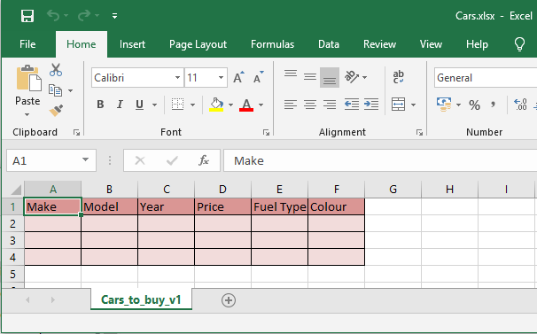
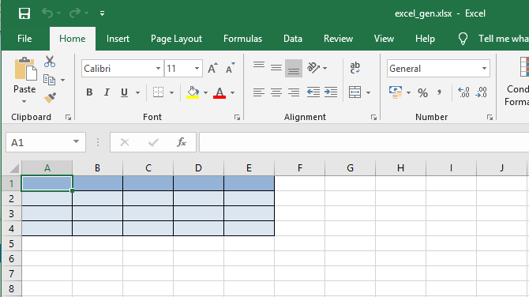

# Excel Generator

This is a quick excel generator CLI/GUI Tool, with the GUI created using PySide2 GUI library.

This tool allows for quick generation of basic excel sheet formatted into a table.

(The primary object of this project is to learn how to use QT5 / PySide2 Library to create a GUI interface)

## GUI

To Create py file from the QT Designer ui file:

```bash
pyside2-uic gui_menu.ui -o main.py
```

## CLI Tool

The CLI version allows for the program to be executed via a Terminal.

```bash
python excel_gen_cli.py -f "Houses" -p "PATH\Where\To\Save" -th "Table, Header, names, seperated, by, a, comma" -ac Accent2

# To gen a formatted file quickly
python excel_gen_cli.py -qc True
```

| Argument        | Alias | Help                                                                 | Default Value             |
| --------------- | ----- | -------------------------------------------------------------------- | ------------------------- |
| --table_header  | -th   | Column Table Names e.g "Car Make, Model, Year, Price"                |                           |
| --filename      | -f    | Name of the file to be created                                       | Sheet1                    |
| --filepath      | -p    | Location where file should be saved                                  | Same place as file called |
| --sheetname     | -s    | Name of the Excel Sheet                                              | Sheet1                    |
| --rows          | -r    | \<Num>                                                               | 4                         |
| --columns       | -c    | \<Num>                                                               | 5                         |
| --accent_type   | -ac   | Accent Types (Accent1 - 5 exist)                                     | Accent1                   |
| --quick_create  | -qc   | Allows for quick generation of file (uses most defaults)             | False                     |
| --force_columns | -fc   | Enables for more cols to be created than table header names provided | False                     |

## Examples

```bash
# Normal Usage
python excel_gen_cli.py -f Cars -s Cars_to_buy_v1 -p "/home/ncy/projects/cars_proj/" -th "Make, Model, Year, Price, Fuel Type, Colour" -ac Accent2

# Simple use . to use current directory
python excel_gen_cli.py -f Cars -s Cars_to_buy_v1 -p "." -th "Make, Model, Year, Price, Fuel Type, Colour" -ac Accent2

# Generate Rows and columns
python excel_gen_cli.py -f Cars -s Cars_to_buy_v1 -p "." -ac Accent2 -r 5 -c 10

# Generator columns with headers, but format table for more columns
python excel_gen_cli.py -f Cars -s Cars_to_buy_v1 -p "." -th "Make, Model, Year, Price, Fuel Type, Colour" -c 10 -fc true
```



```bash
# Quick Create
python excel_gen_cli.py -qc True
```


